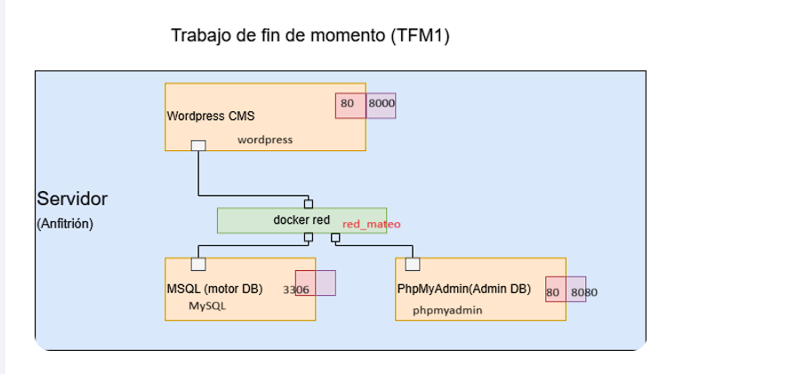

# Creación de red Docker para alojar WordPress con MySQL y phpMyAdmin

## 1. Título  
**Creación de red Docker para alojar WordPress con MySQL y phpMyAdmin**

## 2. Tiempo de duración  
**90 minutos**

## 3. Fundamentos

Esta práctica tiene como objetivo la creación de una red Docker donde se alojará WordPress, conectada a una base de datos MySQL y gestionada con phpMyAdmin. La información de la base de datos se almacena en un volumen persistente. Se implementó un contenedor con MySQL como servidor de base de datos, otro con phpMyAdmin como herramienta de gestión y el último con WordPress como entorno de desarrollo de sitios web. La comunicación entre ambos contenedores se logró mediante una red personalizada en Docker, evitando la exposición innecesaria de puertos al exterior, lo que refuerza la seguridad y la eficiencia en la gestión de servicios.

### Comandos utilizados

- `docker network create`: Para crear redes personalizadas.
- `docker run`: Para ejecutar contenedores.
- `docker volume create`: Para ejecutar contenedores.
- `docker network inspect`: Para verificar qué contenedores están conectados a una red.


## 4. Conocimientos previos

- Conocimiento básico de Docker (contenedores, volúmenes, redes).
- Fundamentos de bases de datos relacionales.
- Uso básico de MySQL y phpMyAdmin.

## 5. Objetivos a alcanzar


- Crear una red personalizada en Docker.
- Crear un volumen para la persistencia de datos.
- Crear un contenedor para MySQL
- Crear un contenedor para phpmyadmin
- Crear un contenedor para Wordpress
- Conectar los 3 contenedores a la misma red.


## 6. Equipo necesario

- Computadora con Docker y WSL habilitado.
- Navegador web.
- Terminal compatible con Docker CLI.
- Conexión a Internet para descargar las imágenes oficiales.

## 7. Material de apoyo

- [Documentación oficial de Docker](https://docs.docker.com/)
- [phpMyAdmin Docs](https://docs.phpmyadmin.net/)
- [MySQL Docs](https://dev.mysql.com/doc/)

## 8. Procedimiento

### Paso 1: Crear red personalizada en Docker

```bash
docker network create red_mateo
```
<p align="center">
  
</p>

### Paso 2: Crear volumen

```bash
docker volume create backup

```
### Paso 3: Crear contenedor para MySQL

```bash
docker run -d \
  --name mysql \
  --network red_mateo \
  -e MYSQL_ROOT_PASSWORD=root \
  -e MYSQL_DATABASE=wordpress \
  -e MYSQL_USER=wordpress \
  -e MYSQL_PASSWORD=wordpress \
  -v backup:/var/lib/mysql \
  mysql:latest

```
<p align="center">
  
</p>

### Paso 3: Crear contenedor para phpMyAdmin

```bash
docker run -d \
  --name phpmyadmin \
  --network red_mateo \
  -e PMA_HOST=mysql \
  -p 8080:80 \
  phpmyadmin/phpmyadmin

```
<p align="center">
  
</p>


### Paso 3: Crear contenedor para Wordpress

```bash
docker run -d \
  --name wordpress \
  --network red_mateo \
  -e WORDPRESS_DB_HOST=mysql:3306 \
  -e WORDPRESS_DB_USER=wordpress \
  -e WORDPRESS_DB_PASSWORD=wordpress \
  -e WORDPRESS_DB_NAME=wordpress \
  -p 8000:80 \
  wordpress:latest


```
<p align="center">
  
</p>


### Paso 4: Acceso a phpMyAdmin


1. Abrir el navegador en `http://localhost:8080`
2. Ingresar:
   - Usuario: `wordpress`
   - Contraseña: `wordpress`


<p align="center">
  
</p>

### Paso 4: Acceso a Wordpress


1. Abrir el navegador en `http://localhost:8000`
2. Realizamos la configuracion. 

<p align="center">
  
</p>

## 9. Resultados

La red personalizada red_mateo fue creada correctamente.

Los contenedores mysql, phpmyadmin y wordpress se ejecutaron con éxito en la red.

La interfaz de phpMyAdmin fue accesible en http://localhost:8080 para gestionar la base de datos wordpress.

WordPress fue accesible en http://localhost:8000, funcionando correctamente con la base de datos de MySQL.

<p align="center">  </p>

### Diagrama de conexión 

En la siguiente imagen podemos observar el comportamiento y la conexión entre los contenedores.

<p align="center">  </p>


## 10. Conclusiones

Esta práctica permitió comprender cómo crear y configurar una red personalizada en Docker para interconectar varios contenedores de manera segura y eficiente. Se observó que la comunicación entre WordPress, MySQL y phpMyAdmin se logró mediante la red interna sin necesidad de exponer puertos innecesarios, lo que mejora la seguridad del entorno. La utilización de volúmenes persistentes aseguró que los datos de la base de datos se mantuvieran de forma constante a través de los reinicios de los contenedores.

## 11. Bibliografía

Docker. (2024). *Docker Docs*. https://docs.docker.com/

IBM. (2025). Contenedores Docker y las interfaces de red en QRadar. IBM Documentation. https://www.ibm.com/docs/es/qsip/7.5?topic=qradar-docker-containers-network-interfaces

Miell, I., & Sayers, A. (2019). *Docker in practice*. Simon and Schuster.

MySQL. (2024). *MySQL 8.0 Reference Manual*. https://dev.mysql.com/doc/

Nickoloff, J., & Kuenzli, S. (2019). *Docker in action*. Simon and Schuster.

phpMyAdmin. (2024). *phpMyAdmin Official Documentation*. https://docs.phpmyadmin.net/
